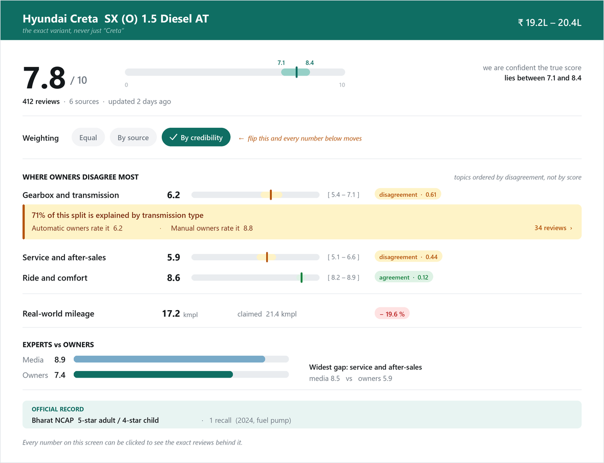

# Milestone 2 — Wireframe Demo

**Revix** · *driven by reviews.*
A short proposal: what we will draw, who draws it, and by when.

| | |
|---|---|
| **Milestone** | 2 — Wireframe Demo |
| **Starts** | Monday 3 August 2026 |
| **Demo** | **Friday 14 August 2026** |
| **Team** | Aditya Nariyapara, Devika Jonjale, Saachi Shinde |
| **Comes after** | [Review 1 — concept, market gap and literature review](01-concept-market-gap-and-literature-review.md) |

---

## 1. What we are doing

A **wireframe** is a drawing of a screen made before any code is written. It shows *what goes where, and why*. The point is that it is cheap to change — moving a box in a drawing takes ten seconds; moving it after the screen is built takes a day.

| A wireframe **is** | A wireframe **is not** |
|---|---|
| A layout — what appears, and where | A finished visual design |
| An order — what the eye reaches first | A choice of colours, fonts or logo |
| An interaction — what happens on a click | Working software |
| Realistic placeholder content | Real data |

For this milestone we will draw the main screens of Revix, link them so they can be clicked through, and walk our mentor through them.

## 2. Why it matters for this project

Revix's whole argument is that a verdict should show **its trust weighting, its uncertainty, and its evidence**. If those three things are not obvious on screen, the project has failed no matter how good the pipeline is. So the screen has to make the argument.

| What we claim | What the screen must prove it with |
|---|---|
| We weigh reviews by trust, not star average | A visible switch that changes the numbers when flipped |
| We are honest about uncertainty | A range on screen, not a single decimal |
| Every number is traceable | Every number is clickable, and opens the reviews behind it |
| Disagreement is the useful signal | The most-disagreed-upon topic sits at the top |

## 3. What we will hand over

| # | Deliverable |
|---|---|
| 1 | Wireframes of the main screens, with short notes on each |
| 2 | A click-through: search → verdict → evidence, so it can be used like a real product |
| 3 | The weighting switch shown **before and after**, with the changed numbers marked |
| 4 | Two examples — one car and one two-wheeler — so the design works for both |
| 5 | Images exported and committed to the repository, so the work is versioned |
| 6 | A short rehearsed walkthrough, about five minutes |

**Level of detail: medium.** Real labels and realistic numbers, but greyscale and no final styling. Our screens are full of numbers and ranges, so blank grey boxes would not tell us whether they are readable — but colour and font choices at this stage would only invite feedback about looks instead of about structure.

## 4. Screens we will draw

| Priority | Screen | What it shows |
|---|---|---|
| **Must** | **Verdict** | One vehicle, scored topic by topic. The product. |
| **Must** | **Evidence drawer** | The actual reviews behind any number, and the weight each carried |
| **Must** | **Compare** | Two vehicles side by side, including when they are too close to call |
| **Must** | **Search** | Find a vehicle, then pick the exact variant |
| Should | Metrics | Our own accuracy numbers, in public |
| Should | Method | Plain-language explanation of how a score is worked out |
| Should | Admin | Which sources are alive, and one shown deliberately failing |
| **Won't** | Accounts, settings, watchlists, mobile app | Out of scope. We will not draw them. |

**Agreed in advance:** if we fall behind at the Friday 7 August checkpoint, the *Should* screens drop to rough sketches and everything goes into the four *Must* screens. The verdict screen and the weighting switch are never cut.

### What the verdict screen should look like

This is the target we are drawing towards. Numbers are placeholders.

## 5. The one thing the demo must show

The same vehicle, the same reviews, **two different weighting strategies, two different answers.**

| Topic | Every review counts equally | Weighted by how much each can be trusted | Change |
|---|---|---|---|
| Overall | 8.3 | **7.8** | ▼ 0.5 |
| Service and after-sales | 7.1 | **5.9** | ▼ 1.2 |
| Gearbox and transmission | 7.4 | **6.2** | ▼ 1.2 |

**What we say while showing it:** *"Same 412 reviews. On the left, every review counts once — which is what every review site does today. On the right, reviews are weighted by how much they can be trusted, so long-term owners count for more. Service drops by 1.2 points. That gap is the product."*

For a wireframe this is simply **two drawings and the differences marked**. It must be prepared in advance, not improvised on the day.

## 6. Who does what

Each person draws the screens they will later build.

| Who | Screens | Also responsible for |
|---|---|---|
| **Saachi Shinde** | Verdict, Search | Design lead — keeps all screens consistent, assembles the click-through, presents |
| **Devika Jonjale** | Evidence drawer, Compare, Method | That every number shown is something the pipeline can actually produce |
| **Aditya Nariyapara** | Metrics, Admin | Realistic placeholder data, and the two worked examples (one car, one bike) |

**Rule:** every screen is looked at by someone who did not draw it, before 7 August.

## 7. Timeline

Two weeks, ten working days.

| When | What happens | Who |
|---|---|---|
| **Fri 31 Jul** | Review 1. Write down the mentor's feedback the same day. | All |
| **Mon 3 Aug** | Kickoff, together. Pick the tool. Agree the screen list, the flow, and how a score and a range will always be drawn. | All |
| **Tue 4 – Wed 5 Aug** | Rough sketches of every screen in one sitting, then the verdict screen properly. | Saachi leads |
| **Thu 6 – Fri 7 Aug** | Evidence drawer and Compare. **Friday is the checkpoint: does every screen exist in some form?** Apply the cut rule if not. | Devika leads |
| *Sat 8 – Sun 9 Aug* | *Buffer. Deliberately empty. If we use it, we were behind.* | — |
| **Mon 10 – Tue 11 Aug** | Remaining screens, then link everything into a click-through and build the before/after pair. | Aditya + Saachi |
| **Wed 12 Aug** | Tidy-up. Make every screen consistent, add the notes, check the placeholder numbers are believable. | All |
| **Thu 13 Aug** | **Stop drawing.** Rehearse twice, timed. Export the images into the repository. | All |
| **Fri 14 Aug** | **Demo.** | Saachi presents, all answer |

**Two rules that protect this:** the tool is chosen on 3 August and never changed afterwards, and 13 August is for rehearsing, not drawing.

## 8. What "done" looks like

- [ ] The four **Must** screens are drawn properly; the three *Should* screens exist at least as sketches
- [ ] Someone can click from search → verdict → evidence without being guided
- [ ] The weighting switch exists as a before-and-after pair with the changes marked
- [ ] One car and one two-wheeler are both drawn
- [ ] Scores and ranges are drawn the same way on every screen
- [ ] Images are committed to the repository
- [ ] The walkthrough has been rehearsed twice and runs under six minutes

## 9. What we will ask our mentor

1. Is the verdict screen readable at a glance, or is it too crowded?
2. Does the word "divergence" mean anything to a normal buyer, or do we need a simpler word?
3. Is the weighting switch understandable without us standing there explaining it?
4. What would a real buyer look for first that we have not put on the screen?

## 10. Things we still have to decide

| # | Decision | Who | By when |
|---|---|---|---|
| 1 | Which tool we draw in | All three | Mon 3 Aug |
| 2 | Which two vehicles are our examples — one car, one bike | Aditya | Mon 3 Aug |
| 3 | What we call "divergence" on screen | Devika | Tue 4 Aug |
| 4 | Whether the verdict screen shows everything, or a reduced version | Mentor, on 14 Aug | Fri 14 Aug |

**The main risk** is that the verdict screen turns out to be too crowded — it carries scores, ranges, disagreement, splits, a media-versus-owner comparison and the official record. So we will draw a reduced version alongside the full one and let our mentor choose, rather than defending only one.

---

**After this milestone**, the screens we agree on become the plan for the actual build, which starts the week of 17 August. Full twelve-week plan in [docs/proposal.md](../proposal.md), section 24.
